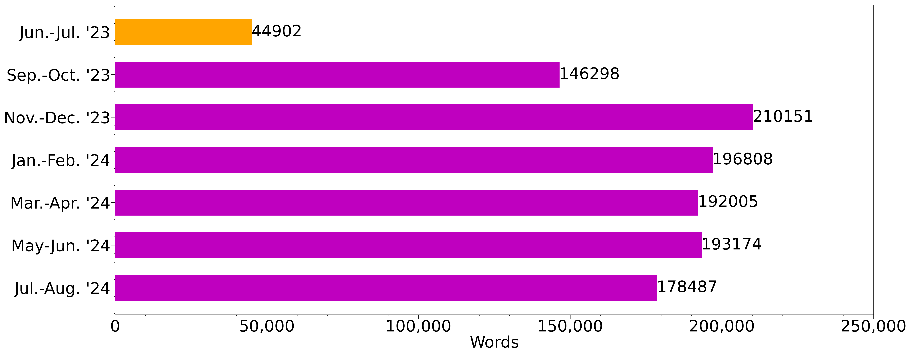

# MooersLab

## Quick Links

- [ACA talks](https://github.com/MooersLab#aca-talks)
- [bash](https://github.com/MooersLab#bash-related)
- [Bayesian Data Analysis](https://github.com/MooersLab#bayesian-data-analysis)
- [Clojure](https://github.com/MooersLab#clojure)
- [Cryocrystallography](https://github.com/MooersLab#cryocrystallography)
- [Crystallization](https://github.com/MooersLab#crystallization)
- [Crystallographic computing](https://github.com/MooersLab#crystallographic-computing)
- [Emacs](https://github.com/MooersLab#emacs-related)
  + [Talks about Emacs](https://github.com/MooersLab#my-talks-about-emacs)
- [Experimental design](https://github.com/MooersLab#experimental-design)
- [Grant writing](https://github.com/MooersLab#grant-writing)
- [Jupyter and Colab](https://github.com/MooersLab#jupyter-and-colab-related)
- [LaTeX](https://github.com/MooersLab#latex-related)
- [Literate programming and computational narratives](https://github.com/MooersLab#literate-programming)
- [Machine learning]
- [Molecular Biophysics]
- [Molecular Graphics Related](https://github.com/MooersLab#molecular-graphis-related)
- [Molecular Simulation](https://github.com/MooersLab#molecular-simulation)
- [Protein structure]
- [PyMOL](https://github.com/MooersLab#pymol)
- [Python](https://github.com/MooersLab#python)
- [RNA Editing]
- [RNA Structure]
- [SAXS](https://github.com/MooersLab#small-angle-scattering)
- [SSRL talks](https://github.com/MooersLab#ssrl-talks)
- [Structure-based drug design]
- [Supercomputing](https://github.com/MooersLab#supercomputing-related)
- [Time management](https://github.com/MooersLab#time-management)
- [Typst](https://github.com/MooersLab#typst-is-exciting) 
- [vim/neovim](https://github.com/MooersLab/MooersLab/blob/main/README.md#vim-and-neovim)
- [Writing tools](https://github.com/MooersLab#writing-productivity-tools)
  + [Accountability tools](https://github.com/MooersLab#writing-progress) 
  + [Manuscript writing support](https://github.com/MooersLab#manuscript-writing-support)
  + [Metacognition tool](https://github.com/MooersLab#writing-log-for-planning-manuscripts)
- [Voice computing](https://github.com/MooersLab#voice-computing)
  + [biological-crystallography-voice-in](https://github.com/MooersLab/biological-crystallography-voice-in)
- [Videos of talks](https://github.com/MooersLab#videos-related-to-these-repositories)

## Introduction
This site contains the public repositories of the Dr. Blaine Mooers Lab, Department of Biochemistry and Physiology, College of Medicine, University of Oklahoma Health Sciences, Oklahoma City, Oklahoma, USA.
My lab determines the structures of biological macromolecules and their complexes with drugs, mainly using [X-ray crystallography](https://en.wikipedia.org/wiki/X-ray_crystallography#Biological_macromolecular_crystallography) and sometimes small-angle [ X-ray scattering](https://en.wikipedia.org/wiki/Small-angle_X-ray_scattering), a method that does not require crystals.
We grow crystals using advanced experimental design methods and collect X-ray diffraction data in-house and frequently at the [Stanford Synchrotron Radiation LightSource](https://www-ssrl.slac.stanford.edu/content/) and sometimes at the four other significant light sources in the US.
We also do structure-based drug design using supercomputers.

We are not computer scientists; we leave the heavy-duty coding to the professionals.
However, we write code occasionally to help advance our science and the science of others.
We have developed software tools to ease the writing of PyMOL scripts to make molecular images.
These tools are available for the top 19 text editors and the Jupyter, Colab, and R Markdown notebooks.
These text editors can make your work lighter and have many wonderful features, but Emacs is our favorite because, thanks to Emacs Lisp, it is the most customizable text editor.
However, we caution that one must take a disciplined approach to Emacs because it is a tinker's paradise.

We often use the web service called *Overleaf* to write manuscripts, grant applications, slideshows, posters, and lab notebooks in LaTeX.
We spent five years trying the alternative Markup languages.
This was before I became aware of Overleaf, which made working with LaTeX much easier.
Some of our LaTeX templates are in the repositories found here (see the section on [LaTeX](https://github.com/MooersLab#latex-related) below).

Overleaf is a great way to get started with LaTeX.
However, Emacs provides access to more powerful editing features.
You can use GhostText to send a page from Overleaf to Emacs for editing.
Nonetheless, Overleaf is great for collaborative writing. 
When using Chrome or Microsoft Edge, you can use the Voice In plugin for Google Chrome to dictate prose in Overleaf.

We are also fans of Jupyter Notebooks.
Something inexplicable about Jupyter Notebooks makes coding in them fun.
We have developed tools for working on Jupyter with PyMOL and CCTBX.
Jupyter Notebooks may be frustrating for those without at least some formal training in computing.
You must always be aware of your computer's state, or at least the state you expected it to be in.
Those who lack this awareness will run into a lot of trouble.

We also like R Markdown notebooks.
Although somewhat less interactive than Jupyter notebooks, these are simpler to put under version control, and they support custom libraries of code snippets with tab triggers and tab stops.
The RStudio IDE provides excellent support for R Markdown notebooks.
You can have the best of both worlds by editing R Markdown notebooks in Emacs and using the reticulate package to harness Jupyter kernels to run Python inside the notebook.

We code in mainly in Python but sometimes in Bash, R, Clojure, Elisp, Julia, Fortran, and C/C++.
It is hard to be a polyglot programmer due to limitations on mental bandwidth.

Our repositories are grouped by category.
Some repositories are listed in several categories.
This listing is still a work in progress.
Some repositories still need to be added to this page.
Seventeen repos are forks to other people's repositories.
Visit the [repositories tab](https://github.com/MooersLab?tab=repositories) to see the complete list of repositories.

In the spring of 2023, I started a [MooersLab](https://codeberg.org/MooersLab) site on Codeberg.
A foundation runs Codeberg and has 13 years of funding.
Some repositories on GitHub get mirrored on Codeberg.

If you like a repository, please click on the star in the upper right.

<!--
(PS The ultimate text editor for writing prose and code is Emacs.
All paths through text editors lead to Emacs.
Some people get stuck all too long in Vim or NeoVim, which are great editors.)
-->

# Index of repositories

## ACA talks
- [ACA2021](https://github.com/MooersLab/ACA2021)
- [ACA2022](https://github.com/MooersLab/ACA2022)
- [ACA2023](https://github.com/MooersLab/dsd4xtals)
- [ACA2024](https://github.com/MooersLab/ACA2024)

## Bash related
- [Bash functions for Schooner at OSCER](https://github.com/MooersLab/bashFunctions4oscer)
- [Multiple file transfer](https://github.com/MooersLab/multipleFileTransfer)
- [Function that counts lines of uncommented code](https://github.com/MooersLab/count-lines-of-code/tree/main)

## Bayesian Data Analysis
- [Bayesian Data Analysis (BDA) Speech-to-Text expansions of acronyms](https://github.com/MooersLab/bayesian-data-analysis-voice-in/blob/main/README.md)
- [JointProb](https://github.com/MooersLab/jointprob1D) R Markdown and Jupyter notebooks for the Saturday JointProb study group active in 2022 and 2023.

## Blog
- [Lab website with blog posts](https://mooerslab.github.io/year-archive/)

## Clojure
- [ClojConj 2023 talk about protein structure superposition via probabilistic programming in Clojure](https://www.youtube.com/watch?v=lDweOPGHLB8&t=51s)
- [quizzes about Clojure](https://github.com/MooersLab/qclj) These quizzes are useful for improving command recall after a break from using Clojure for several months.

## Cryocrystallography
Tools to enhance success at cryopreserving protein and nucleic acid crystals.

- [Easing cryosolution preparation](https://github.com/MooersLab/cryosolution-generation)

## Crystallization
Tools to support protein and nucleic acid crystallization.

- [Crystal scoring key](https://github.com/MooersLab/crystal-score-key)
- [Crystallization drop observation record for 24 well tray](https://github.com/MooersLab/crystallization-observation-record-24wells)
- [Vary One-Factor-at-a-Time (OFAT) experimental designs](https://github.com/MooersLab/ofat4xtals)
- [Definitive Screening Designs](https://github.com/MooersLab/dsd4xtals)

## Crystallographic computing

### CCTBX related

<a id="cctbxsnips-for-notebooks"><h4>For use in notebooks</h4></a>

- [Jupyterlab cctbx snippets](https://github.com/MooersLab/jupyterlabcctbxsnips) CCTBX snippets for JupyterLab with the *jupyterlab-snippets* extension or the jupyterlab-snippets-mutlimenus extension.
- [Jupyterlab cctbx plus snippets](https://github.com/MooersLab/jupyterlabcctbxsnipsplus) The variant of the *jupyterlabcctbxsnips* library with comments to guide editing of the snippets.
- [Tagged cctbx snippets](https://github.com/MooersLab/taggedcctbxsnips) The variant for the Elyra-snippet extension for Jupyterlab. The snippets have tags in their metadata that can be used to retrieve code snippets.
- [Tagged cctbx plus snippets](https://github.com/MooersLab/taggedcctbxsnipsplus) The variant for the Elyra-snippet extension for Jupyterlab. The tab stops in a comment block to guide the editing of the live snippet. The snippets have tags in their metadata that can be used to retrieve snippets.
- [Colab cctbx snippets](https://github.com/MooersLab/colabcctbxsnips) Colab snippets.

<a id="cctbxsnips-for-editors"><h4>For use in text editors</h4></a>

- [cctbxsnips-Emacs](https://github.com/MooersLab/cctbxsnips-Emacs) CCTBX snippets for the *yasnippet* snippet system in for Emacs.
- [cctbxsnips-SublimeText3](https://github.com/MooersLab/cctbxsnips-SublimeText3) CCTBX snippets for Sublime Text 3 (ST3).
- [cctbxsnips-VSC](https://github.com/MooersLab/cctbxsnips-VSC) CCTBX snippets for Visual Studio Code (VSC).
- [cctbxsnips-UltiSnips](https://github.com/MooersLab/cctbxsnips-Ultisnips) CCTBX snippets for Vim or NeoVim via UltiSnips plugin.
- [cctbxsnips-neosnippets](https://github.com/MooersLab/cctbxsnips-neosnippets) CCTBX snippets for Vim or NeoVim via neosnippets plugin.
- [cctbxsnips-Snipmate](https://github.com/MooersLab/cctbxsnips-snipmate) CCTBX snippets for Vim or NeoVim via snipmate plugin.
- [cctbxsnips-Atom](https://github.com/MooersLab/cctbxsnips-Atom) CCTBX snippets for Atom. Have the same format required for Pulsar.

## Curve-fitting software
- [List of curve-fitting software](https://github.com/MooersLab/Curve-fitting-software) This list includes both proprietary and free software.

## Design of Experiments (DoE) [See Experimental Design below]

## Emacs related
Today's Emacs is not your grandfather's Emacs.
The median age of an Emacs user is 32, not 77, as you might expect for a text editing program who is about 40 years old.
This is due to a very active community of young users centered around several YouTube channels, Emacs Lisp being well-designed to customize Emacs, an online annual international conference (emacsconf), the popularity of org-mode, and a welcoming community of developers.
Elisp was first used in Emacs 19 in 1985, with the GNU Emacs 19.3, about ten years after the project's start.

It should be noted that Emacs is single-threaded.
This is a significant limitation when it comes to loading large embedded images.
The developers have and continue to optimize the part of the code base that relies on C for speed so single treading is generally not a hindrance for most uses.

One group has started a 'lem' project that uses Common Lisp to build a multithreaded text editor similar to Emacs. 
Unfortunately, `lem` is not user-ready in our experience. 
Perhaps, Emacs users will migrate to `lem` someday. 
In the meantime, it is worth continuing to use Emacs, knowing that a multithreading alternative is under development.

The Emacs project is open-source and run by several hundred volunteer core developers.
The project runs by consensus.
There is no succession issue.
The project's benevolent dictator for life stepped down about 15 years ago.
After doing so, an explosion of creativity occurred.

According to the [Lindy effect](https://www.sciencedirect.com/science/article/abs/pii/S0378437117305964?via%3Dihub), it is likely that Emacs will remain in use for another 50 years.
Exposure to elisp coding in Emacs leads some to pick up other languages in the Lisp family, including Clojure.
This, in turn, leads them to understand programming more deeply.

### Tools to support the mastery of Emacs

Mastery is in the eye of the beholder.
Total mastery is impossible with >5000 packages.

- [Popup menus of GNU Emacs core commands you want to master](https://github.com/MooersLab/emacs-learning-spiral-hydra)
- [Configuration for Emacs30 to support structured editing](https://github.com/MooersLab/emacs30venturatreesitterconfig)
- [Some simple hydras in Codeberg repo](https://codeberg.org/MooersLab/emacs-hydra-examples)
- [Quizzes about Emacs to improve recall of keybindings](https://github.com/MooersLab/qemacs) Ten minutes boosting your recall on a particular topic can save 10, 100, or 1000 hours of Google searches, especially if you are prone to getting side-tracked in the Google-verse.

### Sample configurations

These files can help you on your Emacs journey. 
You probably just want to copy bits of configuration to integrate into your own workflow.

- [A simpler approach to using org in place of the init.el file: what I use today](https://github.com/MooersLab/emacs-simple-init-org/tree/main)
- [Compiling Emacs30 on Ventura (macOS 13.2) with tree-sitter](https://github.com/MooersLab/emacs30macos13treesitter) This protocol compiles Emacs from source with tree-sitter support for structured editing of computer code on macOS.
- [Compiling Emacs30 on Ubuntu22.04 LTS with tree-sitter](https://github.com/MooersLab/emacs30ubuntu22) This protocol compiles Emacs with tree-sitter support on Ubuntu.
- [crafted-emacs user config](https://github.com/MooersLab/crafted-emacs-config) My user configuration file (config.el) for the crafted-emacs profile. I did install use-package and used it to install several packages. The base profile has the Doom theme, Vertico completion stack, and eglot. I added my org-agenda config and my favorite key bindings. I am currently *luvin* it.
- [latex-emacs29 configuration](https://github.com/MooersLab/latex-emacs) A configuration file enhancing the use of LaTeX in Gnu Emacs version 29.0.5. Includes org-mode configuration.
- [latex-emacs28 configuration](https://github.com/MooersLab/latexemacs28) Similar to above but for Gnu Emacs version 28.
- [latex-emacs30 configuration](https://github.com/MooersLab/latexemacs30) Similar to above but for Gnu Emacs version 30.
- [scimax user.el](https://github.com/MooersLab/scimaxuserconfig) Scimax is the Emacs configuration that Dr. John Kitchin of Carniege-Mellon University is developing to support reproducible research by scientists with Gnu Emacs. The *user.el* file for Scimax enables Scimax users to add keybindings and packages. I added features from latex-emacs and config.org.
- [config.org](https://github.com/MooersLab/configorg) My default GNU Emacs version 30 configuration file.

### Document templates and workflows in LaTeX and Org-mode

Org-mode is a blend of the best features of markdown and LaTeX.
Although you can use org-mode without knowledge of LaTeX, you do not have to give up any of your skills and knowledge of using LaTeX to use org-mode.
You gain powerful tools for navigating the file, making major rearrangements of its sub-trees, and interfacing with many other programs, such as Gnuplot, for generating data plots from tables.
Org-mode's table editor is reason enough to adopt its use because it makes assembling a table easy.
For example, you can draft a table in org-mode, drop it into co-pilot, and ask it to reformat it LaTeX.

#### Org-mode templates
- [Writing log template in Org-mode](https://github.com/MooersLab/writingLogTemplateInOrg) Template for tracking your actions, decisions, and plans for any serious writing project that takes more than one session to finish. The LaTeX version is listed in the LaTeX section for use on Overleaf or in Emacs.
- [Org-mode manuscript template](https://github.com/MooersLab/manuscriptInOrg) The manuscript will be exported to PDF after being run through LaTeX. This is for the first submission. This is for the lovers of org-mode. The export from org to PDF is fast and painless in Emacs.
- [Annotated bibliography in org-mode](https://github.com/MooersLab/annotated-bibliography-org)

### LaTeX related
See the section about LaTeX for more repositories.

- [Slides about workflow in LaTeX](https://github.com/MooersLab/BerlinEmacsAugust2022) These were presented to the Berlin Emacs Meetup in August 2022. Regrettably, the talk was not recorded. It was a 90-minute presentation.
- [snippets for latex-mode in Emacs](https://github.com/MooersLab/snippet-latex-mode) LaTeX code snippets for yasnippets.

### My talks about Emacs
The more I am exposed to other Emacs community members, the more I appreciate how little I know about Emacs. 
The growing disease of expertise tends to inhibit sharing knowledge with beginners.
Advanced beginners tend to give talks that are more accessible to beginners because they tend to assume less prior knowledge.
As an advanced beginner, I find the pressure of assembling a talk an effective way of forcing myself to master new material.

- [emacsconf 2021 talk about rendering molecular graphics with PyMOL in org literate programming files](https://emacsconf.org/2021/talks/molecular/) Video and comments.
- [EmacsATX Meetup Talk, 4 May 2022: functional programming in Emacs lisp](https://github.com/MooersLab/EmacsATX4May2022) Slides.
- [Video link to talk about GhostText, Oklahoma Data Science Workshop, July 2022](https://mediasite.ouhsc.edu/Mediasite/Channel/python/watch/4da0872f028c4255ae12935655e911321d)
- [Slides from talk about GhostText, Data Science Workshop, July 2022](https://github.com/MooersLab/DSW22ghosttext) GhostTexT rocks! It enables Emacs to edit textboxes on websites. You can use GhostText to bring the full power of Emacs to Overleaf (*Important:*  use the legacy version rendering of the text area in Overleaf to get text imported into a LaTeX buffer).
- [emacsconf 2022 talk about using Emacs to edit Jupyter cells via GhostText and atomic-chrome](https://emacsconf.org/2022/talks/jupyter/) Video and comments.
- [emacsconf 2023 talk about using voice-computing with Emacs to enhance productivity](https://emacsconf.org/2023/talks/voice/) Video, transcript, and comments.

### Voice computing for Emacs
- [Voice-In library for emacs](https://github.com/MooersLab/emacs-voice-in)
- [Voice-In library for org-mode](https://github.com/MooersLab/org-mode-voice-in)

## Jupyter and Colab related

### Jupyter and PyMOL

PyMOL can be run in Jupyter via PyMOL's Python API.

#### Snippet libraries for direct use in Jupyter

Multiple extensions for Jupyter support the use of snippets.
However, the support does not include tab stops nor tab triggers, two standard features of snippet support in modern text editors.
The libraries with `plus` at the end of their name have a second copy of the code in a comment.
This copy is marked with the sites of the tab stops where you might want to change the parameter value from its default value.

##### Classics Notebook
PyMOL Python snippets for use in the Classic Jupyter Notebook with the `snippets_menu` notebook extension.

- [jupyternbclassicpymolpysnips](https://github.com/MooersLab/jupyternbclassicpymolpysnips)
- [jupyternbclassicpymolpysnipsplus](https://github.com/MooersLab/jupyterlabpymolpysnipsplus)

##### JupyterLab

PyMOL Python snippets for use in JupyterLab with the jupyterlab-snippets extension.

- [jupyterlabpymolpysnips](https://github.com/MooersLab/jupyterlabpymolpysnips) PyMOL Python snippets for use in JupyterLab with the jupyterlab-snippets extension.
- [jupyternbclassicpymolpysnipsplus](https://github.com/MooersLab/jupyternbclassicpymolpysnipsplus)

PyMOL Python snippets for use with the elyra-snippets extension and with PyMOL.
These snippets can be retrieved with tags in the elyra-snippet GUI.

- [taggedpymolpysnips](https://github.com/MooersLab/taggedpymolpysnips)
- [taggedpymolpysnipspymolpysnipsplus](https://github.com/MooersLab/taggedpymolpysnipspymolpysnipsplus)

#### Snippet libraries for using external editors of Jupyter notebooks
These editors work in Jupyter Notebooks via the GhostText browser plugin.

- [jupyter-vsc-pymolpysnips](https://github.com/MooersLab/jupyter-vsc-pymolpysnips)
- [jupyter-st3-pymolpysnips](https://github.com/MooersLab/jupyter-st3-pymolpysnips)
- [jupyter-emacs-pymolpysnips](https://github.com/MooersLab/jupyter-emacs-pymolpysnips)
- [jupyter-ultisnips-pymolpysnips](https://github.com/MooersLab/jupyter-ultisnips-pymolpysnips)
- [jupyter-snipmate-pymolpysnips](https://github.com/MooersLab/jupyter-snipmate-pymolpysnips)
- [jupyter-neosnippets-pymolpysnips](https://github.com/MooersLab/jupyter-neosnippets-pymolpysnips)
- [jupyter-atom-pymolpysnips](https://github.com/MooersLab/jupyter-atom-pymolpysnips)

##### Demo of GhostText with Jupyter and Emacs

- [emacsconf 2022 talk about using Emacs to edit Jupyter cells via GhostText and atomic-chrome](https://emacsconf.org/2022/talks/jupyter/)

### Colab and PyMOL
- [colabOpenSourcePyMOLpySnips](https://github.com/MooersLab/colabOpenSourcePyMOLpySnips) PyMOL Python snippets for use in Colab with open source PyMOL.
- [colabPyMOLpySnips](https://github.com/MooersLab/colabPyMOLpySnips) PyMOL Python snippets for use in Colab with the incentive PyMOL.

### CCTBX specific
- [Jupyterlab cctbx snippets](https://github.com/MooersLab/jupyterlabcctbxsnips) CCTBX snippets for JupyterLab with the jupyterlab-snippets extension or the jupyterlab-snippets-mutlimenus extension.
- [Jupyterlab cctbx plus snippets](https://github.com/MooersLab/jupyterlabcctbxsnipsplus) The variant of the jupyterlabcctbxsnips library with comments to guide editing of the snippets.
- [Colab cctbx snippets](https://github.com/MooersLab/colabcctbxsnips) Colab snippets.

## Experimental design

### Experimental designs for crystal growth
We provide easy and fast-to-deploy experimental designs for crystallization setups in Excel workbooks.
These designs take three minutes to customize for your experimental needs.
Plots of the results against factor level for each factor are automatically generated, thereby saving the users many hours of tedious coding of the data plots for each crystallization tray.
These workbooks could be adapted to other kinds of experiments.

The OFAT experiments are often used to screen for active factors.
The active factors can then be used in DSD designs to find the optimal conditions to return large crystals.
OFAT experiments are inappropriate for this objective because they do not measure interactions between factors.
Factor interactions are quite common in the crystallization of proteins.

The DSDs tend to be limited to three active factors because of their small size and weaker statistical power.
Larger traditional response surface method designs (RSM) should be used if more factors are suspected of being active or if two or more interactions are expected.
DSD can be thought of as a subset of RSMs.
Their small size is attractive for protein crystallization, where the sample is expensive and scarce.
The small size of DSD experiments opens up the possibility of replicating them to measure the variance.

- [Vary One-Factor-at-a-Time (OFAT) experimental designs](https://github.com/MooersLab/ofat4xtals)
- [Definitive Screening Designs](https://github.com/MooersLab/dsd4xtals)

### Voice In Plus voice-triggered snippets
- [Design of Experiments (DoE): doe.csv](https://github.com/MooersLab/design-of-experiments-voice-in)

## Grant writing
- [Voice Commands for NIH grants](https://github.com/MooersLab/nih-grants-voice-in)
- [Voice commands for NSF grants](https://github.com/MooersLab/nsf-grants-voice-in)

## LaTeX related
Until recently, I wrote a lot in Emacs on 750words.com via GhostText.
I configured the atomic-chrome package for Emacs to go into LaTeX mode when GhostText connects to 750words.
I can also use Emacs to write and edit text in Overleaf via atomic-chrome and GhostText.
This is a very cool way to extend Emacs to websites with weaker support for editing text.

Now I use voice-to-text to dictate in 750words.com or Overleaf.
I use voice commands to insert snippets containing LaTeX code.
See the  section below.

If you do not have extensive experience writing in a markup language like HTML or Markdown, start with one of the flavors of Markdown to become productive as fast as possible.
Many ideas behind the typesetting program Markdown will transfer to LaTeX.
Markdown is easy to use and highly intuitive.
Mastery of Markdown will provide a fallback system if you get stuck debugging the errors in your LaTeX document.
The latter is a common experience for beginning users of LaTeX.

### What about MyST?

*MyST* expands to Markedly Structured Text.
*MyST* is an enhanced version of Markdown developed to interface with Jupyter notebooks and support their utilization in scientific publishing.
You can export files to LaTeX, MS Word, and PDF.

*MyST* is part of the dream of converting Jupyter into a literate programming platform and supporting the conversion of scientific Publications into highly extensible documents.
You can edit *MyST* files in the newer versions of Jupyter Lab and any text editor.

It provides a preview in your default browser that is updated each time you save the `main.md` file.
The lovers of HTML are wowed by this feature.

Live preview extensions are available for Emacs, Vim, and VS Code.
It feels like an underdeveloped version of org-mode, which had all the export capabilities over a decade ago.
It may be more analogous to the well-planned, lean, and efficient R Markdown for the R programming world.

### What about RestructuredText and Typst?

These markup languages are more potent than markdown.
However, very few publishers will accept the source files for these markup languages.
You may be able to submit the PDF generated by one of these systems on your first submission.
However, you will be stuck transferring the contents of your file to MS Word or LaTeX.

#### RestructuredText

This typesetting language uses BibTeX and LaTeX Math.
*RestructuredText* is used by some in the Python world to generate documentation.
The annual SciPy Proceedings have been prepared with it for many years.
It harnesses indentation, for better or worse.
It is not hard to use for a LaTeX user.

#### Typst is exciting
[*Typst*](https://sitandr.github.io/typst-examples-book/book/about.html) compiles many times faster than *LaTeX*.
*Typst* is written in *rust*.
*Typst* essentially provides a live preview.
This may be the main reason to use it for simple documents.

*Typst* has a more modern bibliography management system, but it also supports using BibTeX, which will ease adoption by new users. 

*Typst* also utilizes a more computer programmer-oriented approach to typesetting by using functions.
*Typst* also provides boilerplate styling templates similar to classes in LaTeX.
The typesetting of math equations is similar to that for LaTeX, so LaTeX users will find it easy to adopt.
*Typst* set out to replace LaTeX but has to retain many of its features.

##### Typst is ready for writing scientific manuscripts

It is easy to write a generic manuscript in *typst* for the [first submission PDF](https://github.com/MooersLab/manuscriptInTypst).
The upside is the speed of the compiling of the document.
The corresponding writing log in typst is found [here](https://github.com/MooersLab/writingLogInTypst)

##### Typist in Emacs

*Typst* has been integrated into org-mode.
You can use a `#+typst:` keyword to start lines with *typst* commands.
There is even a *typst* submenu for exporting to PDF or *typ* files.

There is an abandoned `typst-mode` project on GitHub.
The author shifted his efforts to the `typst-ts-mode` project.
Unfortunately, `typst-ts-mode` package is harder to install.

Oh well, `typst-mode` is much easier to install and use.
It provides syntax highlighting and entering `C-c C-p` compiles the document to PDF and displays it in your default PDF viewer almost instantly.
That is all of the support that I need most of the time.

##### Who is typst for?
It might still be more accessible for computer programmers to adopt *typst* than nonprogrammers.
Writers who are not computer programmers will quickly master Common Markdown.
The next step in markup systems will probably still be the LyX editor, which offers a `what you see is what you get` approach to using LaTeX.

### Links to LaTeX-related repositories

- [LaTeX bare-bones template file](https://github.com/MooersLab/barebonesLaTeX/tree/main) This template is for people who want to make a simple document without a lot of bells and whistles.
- [LaTeX tips](https://github.com/MooersLab/latextips)
- [Configuration for Emacs30 to support structured editing](https://github.com/MooersLab/emacs30venturatreesitterconfig)
- [latex-emacs29 configuration](https://github.com/MooersLab/latex-emacs) A configuration file enhancing the use of LaTeX in Gnu Emacs version 29. This is the current release version of Gnu Emacs. Includes org-mode configuration.
- [latex-emacs28 configuration](https://github.com/MooersLab/latexemacs28) Similar to above but for Gnu Emacs version 28.
- [latex-emacs30 configuration](https://github.com/MooersLab/latexemacs30) Similar to above but for Gnu Emacs version 30.
- [Slides about workflow in LaTeX](https://github.com/MooersLab/BerlinEmacsAugust2022) presented to the Berlin Emacs Meetup August 2022. Not recorded. It was a 90-minute lecture.
- [slideshowTemplateInLaTeX](https://github.com/MooersLab/slideshowTemplateLaTeX) Slideshow template with use with the LaTeX package Beamer that supports the making of slides. Our templates make slides that do not look like they were made in LaTeX because we hide the navigation icons that no one ever uses and replace the triangles in bulleted lists with round bullets. Our slides look like they were made in PowerPoint.
- [posterInLaTeX](https://github.com/MooersLab/posterInLaTeX) uses Beamer to make a poster with a simple design. This enables whipping together a poster in a few hours. It is much easier than using a Gaint slide in PowerPoint. Our approach is also saner than the default approach to making a poster with Beamer.
- [LaTeX manuscript template](https://github.com/MooersLab/manuscriptInLaTeX) Generic template for the first submission as a PDF.
- [Writing log template in LaTeX](https://github.com/MooersLab/writingLogTemplate) Place to track progress and plans behind a manuscript.
- [Annotated bibliography template in LaTeX](https://github.com/MooersLab/annotatedBibliography) Every writing project needs one of these. These should be utilized more. They are good for recalling the relevant features of a paper.
- [ditto but for org-mode](https://github.com/MooersLab/annotated-bibliography-org/blob/main/README.md)
- [Diary for 2024 in LaTeX](https://github.com/MooersLab/diary2024inLaTeX) Designed for use on Overleaf.com but can compile locally. Each day is a section. Each month is a chapter. Has an automatically generated index (most markdowns cannot generate indices). Very feature-rich and ready to use. Makes a great electronic scientific notebook because it is searchable and indexed. > 1000-page document at the end of the year compiles to PDF in under a minute on Overleaf.
- [snippets for latex-mode in Emacs](https://github.com/MooersLab/snippet-latex-mode) My LaTeX code snippets for yasnippets.
- [The writer's creed](https://github.com/MooersLab/thewriterslaw) Guidelines for greater productivity as a writer.
- [bib2item3](https://github.com/MooersLab/bib2item3) Python script to convert bibtex.bib file to bibitems in `tex` file format. Bibitems are required by some publishers. They are a pain to create manually.
- [LaTeX Voice In Plus library](https://github.com/MooersLab/latex-voice-in) Speech-to-text commands for inserting LaTeX markup.

## Literate Programming

See the sections on Org-mode and Jupyter and Colab.

## Molecular Graphics Related
[Collection of links for a 15-hour course on Molecular Graphics](https://mooerslab.github.io/MolecularGraphicsLinks/index.html)

## Molecular Simulation

Coming soon. Includes Structure-based Drug Design.

## PyMOL

### Highlights:

- **EasyPyMOL**: go here for an easy start for interactive horizontal scripting on the command line in PyMOL and for the roundview.py function. YouTube videos show how to install the software on various operating systems.
- **pymolshortcuts**: These are very popular. You do not need to be a code writer to use these. This is what most people will want to install. The README.md explains the installation and use.
- **pymolsnips**: For people writing traditional vertical *.pml PyMOL scripts in a text editor. The README.md describes how to install each of the 17 supported text editors. It then shows how to install the snippet library in each editor. Animations show the snippet library in use in each text editor.
- **pymolpysnips**: For people wanting to run PyMOL in one of these computational notebooks: Jupyter, Colab, RStudio, and org-mode.
- **PyMOL wall hangings**: Protocol to convert molecular artwork into large images for framing and hanging on a wall.

### Links
- [pymolrc](https://github.com/MooersLab/pymolrc) My pymolrc file.
- [pymolsnips](https://github.com/MooersLab/pymolsnips) A large collection of PyMOL macro language (pml) code snippets. It contains a link to a webpage with extensive instructions on installing 19 text editors.
- [pymolshortcuts](https://github.com/MooersLab/pymolshortcuts) A large collection of functions mapped to aliases or shortcuts. This collection of functions is very useful for non-coders.
- [EasyPyMOL](https://github.com/MooersLab/EasyPyMOL) Support for horizontal scripting in PyMOL.
- [orgpymolpysnips](https://github.com/MooersLab/orgpymolpysnips) Support for generating computational narratives (literate programming plus interactive computing) in org-mode with PyMOL.
- [rstudiopymolpysnips](https://github.com/MooersLab/rstudiopymolpysnips) Support for literate programming in Rstuido with PyMOL.
- [taggedpymolpysnips](https://github.com/MooersLab/taggedpymolpysnips) Support for literate programming in JuptyerLab with tagged snippets with the elyra-snippets extension and with PyMOL.
- [jupyterlabpymolpysnips](https://github.com/MooersLab/jupyterlabpymolpysnips) PyMOL Python snippets for use in JupyterLab with the jupyterlab-snippets extension.
- [jupyternbclassicpymolpysnips]() PyMOL Python snippets for use in the Classic Jupyter Notebook (invoked with `jupyter nbclassic` with Jupyter Notebook version 7).
- [colabOpenSourcePyMOLpySnips](https://github.com/MooersLab/colabOpenSourcePyMOLpySnips) PyMOL Python snippets for use in Colab with open source PyMOL.
- [colabPyMOLpySnips](https://github.com/MooersLab/colabPyMOLpySnips) PyMOL Python snippets for use in Colab with the incentive version of PyMOL.
- [PyMOL wall hangings](https://github.com/MooersLab/PyMOLwallhangings) Protocol for making oversized images framed and hung on a wall.
<!--
## Structure-based Drug Design
-->

## Python
See the sections on PyMOL, CCTBX, and Jupyter and Colab. Python is in many repositories.

- [PyTexas talk: Voice computing with Python in Jupyter notebooks (slides and audio), 2024 Apr. 21](https://github.com/MooersLab/voice-computing-with-python-in-jupyter-notebooks)

## R statistical program
- [rstudiopymolpysnips](https://github.com/MooersLab/rstudiopymolpysnips) Support for literate programming in Rstuido with Python code for PyMOL.

## Small Angle Scattering
- [SmallAngleScatteringWebpage](https://mooerslab.github.io/SmallAngleScatteringWebpage/index.html)

## SSRL Talks

Talks at the SSRL/LCLS Users Meeting:
- [2024 Workshop talk: Tools to Ease the Use of PyMOL](https://github.com/MooersLab/user-meeting-workshop-2024)

## Time management
- [TimeBlocks](https://github.com/MooersLab/time-blocks) Form for daily scheduling with time blocks.
- [TimeSpent](https://github.com/MooersLab/timeSpent) Time tracking by project with Google Sheets.

## Supercomputing related
High-performance computing (HPC), cluster computing, and cloud computing.

- [Bash functions for Schooner at OSCER](https://github.com/MooersLab/bashFunctions4oscer)
- [Emacs configuration file for schooner supercomputer](https://github.com/MooersLab/emacs4oscer)
- [Multiple file transfer with scp](https://github.com/MooersLab/multipleFileTransfer)
- [Vim configuration file for the schooner supercomputer at OU-Norman](https://github.com/MooersLab/vimrc4oscer)
- [Vim configuration file for SSRL SMB cluster](https://github.com/MooersLab/vimrc4ssrl)
- [Tutorial for biologists on using the supercomputer at OU-Norman](https://github.com/MooersLab/oscer-supercomputer-tutorial)

## Vim (and Neovim)
- [Vim configuration file](https://github.com/MooersLab/vimrc) Current `.vimrc` file for Mac OSX 10.15
- [Vim configuration file for schooner supercomputer](https://github.com/MooersLab/vimrc4oscer)
- [Vim configuration file for SSRL SMB cluster](https://github.com/MooersLab/vimrc4ssrl)
- [Neovim configuration file](https://github.com/MooersLab/neovim-init-file)
- [qvim](https://github.com/MooersLab/qvim) Quiz about Vim commands to improve your recall of the commands after a break from using Vim.

## Voice Computing

Voice computing can be divided into three activities:

- speech-to-text (dictation)
- speech-to-commands
- speech-to-code

Speech-to-text is the easiest to master, the most widely applicable, and the most effective way of enhancing academic productivity.

The video below is an example of using a voice trigger to insert a chunk of LaTeX code that I use to plan each day.
It is inserted after saying `insert start day`.
You can easily make a markdown variant customized to meet your needs.
I am using the Voice In Plus software in Google Chrome.
It also works in Microsoft Edge.
It uses the built-in Speech-to-text software in the web browser on your local machine, so latency is not much of an issue.

### Index of subsections

- [Software that I use](https://github.com/MooersLab#review-of-software-of-the-voice-copmputing-software-that-I-have-used)
- [Talon Voice for voice control and computing](https://github.com/MooersLab#talon-voice-related)
- [Voice In Plus for dictation and voice control in the web](https://github.com/MooersLab#voice-in-plus-related)
- [Whisper for dictation, includes my text replacements](https://github.com/MooersLab#whisper-related)
- [Voice Typing in Google Docs for dictation](https://github.com/MooersLab#voice-typing-in-google-docs-related)
- [Words counts before and after adopting ](https://github.com/MooersLab#Word-Counts-before-and-after-adopting-Voice-Computing)
- [Voice computing-related talks](https://github.com/MooersLab#voice-computing-related-talks)

### Review of the software that I have used

My sampling of the available -related software is highly skewed towards the Mac operating system and Google Chrome.
I have yet to complete a comprehensive survey of the software available for Windows, Linux, and other browsers.
If you are a user of such systems, then the review below will give you a taste of what may be available for these other operating systems

**Voice Typing** is widely available through Google Docs.
It is more accurate than the Voice Control that comes with the Mac and MS Word.
**Voice Typing** supports almost 100 voice commands but does not support custom commands.

**Voice In Plus** has similar accuracy to **Voice Typing** with the addition of custom commands.
I use the latter every day to dictate the first drafts.
I do the rewriting using the keyboard.

OpenAI's **Whisper** may be an order of magnitude more accurate.
It has a latency issue, so live transcription and interactive editing are difficult.
It is also not easy to fine-tune with custom commands.

My primary use of **Whisper** is for transcribing audio files.
I run Python scripts to correct the initial transcript.
These corrections include expanding contractions.
This code also supports inserting simple commands like `new paragraph` during dictation because **whisper** does not know how to divide a transcript into paragraphs.

A very new use of **Whisper** for me is inside Emacs.
I had been aware of its availability for four months.
After my third attempt, I finally figured out how to run **Whisper** in Emacs via the [**whisper.el** package](https://github.com/natrys/whisper.el?tab=readme-ov-file).
The package automates compiling the *whisper.cpp* software and downloading the Whisper LLM.
You record a local audio file of your dictation, and then you transcribe that audio file into text that appears in the current buffer in Emacs.
The `M-H r` keybinding starts the audio recording, and the `C-u M-x r` keybinding transcribes the audio file.
Here, `H` is for the Hyper key; I have it mapped to the righthand command key (alt-key) on a non-Mac keyboard.

The natural unit of dictation with `whisper.el` seems to be the paragraph.
This form of dictation is less interactive than Voice In Plus where you can use the keyboard to edit the currently dictated sentence.
I have yet to figure out the elisp code to apply my text replacements in the transcription step.

The **Superwhisper.** **app** for the Mac is interesting.
It supports dictation in e-mail and elsewhere.
Its support for custom commands is limited; it still needs to support bulk uploading of text replacements before I am sold.
You have to pay a subscription fee to access all its features.
Its features may appeal to people with numerous electronic devices that must be synched with their primary computer.

**Talon Voice** supports all three activities, but speech-to-text accuracy needs to catch up to Voice Typing and Voice In Plus in my experience.
I am currently using Talon Voice for the last two activities.
I plan to increase my use of Talon Voice for dictation.

The **Talon Voice** software is designed to be used by non-coders.
It can be configured with Talonscript files that have a simple syntax that is a subset of Python.
You can customize Talon Voice extensively using the Talonscript files without writing any Python code.

Voice computing supports extending your productivity when you get tired of typing.
Voice computing also supports issuing commands and dictating text while standing.
Voice computing could be a cure for the envy of those colleagues who have standing desks.
You can speak commands to your computer while standing 20 feet away from it and looking out the window.
You can give your body and eyes a break from sitting and staring at the computer screen while remaining productive.

### Word Counts before (orange) and after (magenta) adopting Voice Computing

I have seen a three-fold increase in the total number of words captured in September and October 2023 compared to June and July 2023 before I took up speech-to-text in mid-August 2023.
I have had the same amount of out-of-town travel during the first two periods.
I did not make a conscious effort to capture more words per day.

On the day after Thanksgiving in 2023, I generated almost 12,000 words.
From that point to just before Christmas, I made a concerted effort to generate at least 5,000 words daily.
Then family obligations reduced my daily word generation.
Nonetheless, I had a five-fold increase in the total word count for November and December.

A three-fold increase is more realistic with all of the disruptions from doing experiments, administration, teaching, service, and work-related travel.
The slight decrease in word count after the new year may reflect a shift in my focus toward turning more of my writing into publishable products.
This decrease may reflect more effort focused on editing text.

I was surprised that there was not a more significant decrease.
I may have compensated by using a digital voice recorder (DVR) in mid-January 2024 while away from my computer.
The DVR is superior to a cell phone for recording speech because it does not need to be held next to your mouth.
The DVR can record a Zoom meeting when lying on a desktop or a seminar from the back of a room: Use it ethically.
I transcribe the audio recordings with a locally installed version of OpenAI's whisper.
I use bash Python and bash scripts to reformat the text with one sentence per line for easier downstream editing.

I am still using this device in late September 2024.
It is the best $85 investment I have made in a long time.
It is worth ten times as much. 

Some of my mutterings are rubbish that I cut from the transcripts.
I occasionally harvest useful thoughts that are worth retaining.
I also use the DVR to paraphrase some technical documents that otherwise might be pretty tedious to read.
The DVR has extended my generative writing time by 15-30 minutes daily.

Spending more time on rewriting will lead to fewer new words generated if the time spent on writing is constant.
Rewriting is very time-consuming; it can take as much or more time as generating the text initially.
AI-powered writing assistants make suggestions, but they are not a silver bullet.
You still have to spend a lot of time making the appropriate selections; otherwise, your writing will often be degraded.
These assistants have not saved me time, and they have often wasted it.
But if they keep you engaged in rewriting, they can be helpful.

Text written for grant applications and articles will take even more time because it needs to be highly polished.
Sufficient time has to be scheduled for it.
I plan to spend more time rewriting, so you can expect the new words generated in the next bimonthly reports to decline steadily.

### What about Mac's Dictation and Voice Control software?
One alternative is to use the built-in Dictation software for Mac.
The Mac dictation software used to be worse than the alternatives, like Voice In.
I tried the Mac dictation software again on March 22, 2024,
The error rate was reduced enough to make it competitive.

Its advantage is that it can operate anywhere.
It works inside Emacs and on webpages, including webmail applications like Outlook and Gmail.
The Dictation software relies on an internet connection for older Intel chip-based Macs.
The generated sound waves are sent to a server run by Apple and then returned as text.
I found the delay caused by this transfer to be unnoticeable.

The Voice Control software provided by the Mac OS has not improved since I last tried it.
Its error rate is too high to use for dictation.
The advantage of Voice Control is that it supports customized commands and commands that can be used to run GUI-based software.

### Whisper and a Digitial Voice Recorder
We use open-AI's whisper software to transcribe my audio recordings recorded with the DVR.
The software is wrapped with Python.
I wrote some Python code that reformats the transcript to make it easier for me to edit.
I programmed a text replacement called a new paragraph to introduce breaks between paragraphs because the Whisper software does not automatically identify these breaks.
I am using Python to make my text replacement software.
I use this to add commands like the one above and to replace frequently misinterpreted words.
The approach I am taking with this software is a little more cumbersome than the very easy approach taken by Voice In Plus.

In addition, I reformat the text such that each sentence is written on its own line.
This format eases the subsequent deletion of lines containing rubbish.
You can advance to the next line with the down arrow key in most text editors.
If the current line is one to be deleted, you enter control k.

I have used the dictated text transcribed by Whisper to a lesser extent.
Whisper often inserts garbage during long pauses.
It takes a lot of effort to parse the transcribed text.

It is easier to redo the dictation via Voice In and make corrections as you go.
Dictation of the first draft during the morning commute is analogous to generating a verbal rough draft.
If I leave the DVR at home, I will still compose some prose by speaking aloud.
Once the initial draft has been composed verbally, it is easier to redo it with better word choices after I reach my office.

Of course, generative writing is a small part of writing.
Rewriting, data analysis, figure-making, reading the literature, and managing co-author input takes up most of the time.
You can attempt rewrites of small part of a manuscript before a commute by re-reading the part in question immediately before the commute.
This sounds boring, but exciting new ideas often emerge during this exercise.

Below are links to programming tools to aid the adoption of voice computing.

### Talon Voice-related
- [Expand dictated contractions automatically](https://github.com/MooersLab/talon-contractions)
- [Run bash commands in the terminal by voice command](https://github.com/MooersLab/talon-iterm)
- [Open favorite web pages by voice commands](https://github.com/MooersLab/talon-webpages)
- [Master Talon Voice phonetic alphabet with interactive quiz written in Python](https://github.com/MooersLab/talon-voice-quizzes)
- [Master Talon Voice with interactive quiz written in elisp for Emacs](https://github.com/MooersLab/talon-voice-quiz.el)

### Voice In Plus related

This browser plugin works in Google Chrome and Microsoft's Edge.
It depends on the browser's Speech-to-Text API.
Interactive sessions with it persist for up to 5 to 10 paragraphs, depending on your activity and speed of dictation.
If you pause too long, the software will deactivate after 3 minutes.
If you dictate too quickly, you will get ahead of the software, which will hang. 
You might lose text for some of the words you dictated.
Nonetheless, this software is superior to Mac dictation software, which will only persist for an average of three sentences because it sends the sound waves to a language model located on a remote server.

https://github.com/MooersLab/MooersLab/assets/15176203/0b543abf-aa3e-4dc9-acb4-e98283e6b4f3

#### Generic
- [Master basic Voice In commands with interactive Python quiz](https://github.com/MooersLab/voice-in-basics-quiz)
- [Master basic Voice In commands with an interactive quiz in Emacs](https://github.com/MooersLab/voice-in-basics-quiz.el)
- [Library of 186 English contractions (a must for nonfiction writing)](https://github.com/MooersLab/voice-in-plus-contractions)
- [Jupyter notebook voice triggers](https://github.com/MooersLab/jupyter-voice-in)
- [Full library of commands for Voice In Plus](https://github.com/MooersLab/voice-in-plus-commands)
- [Org-mode](https://github.com/MooersLab/org-mode-voice-in/tree/main)
- [OUHS-related acronym expansions](https://github.com/MooersLab/ouhs-voice-in)
- [LaTeX](https://github.com/MooersLab/latex-voice-in)
- [Generate new writing project commands](https://github.com/MooersLab/new-writing-project-voice-in)
- [Books about scientific writing mapped to voice triggers](https://github.com/MooersLab/scientific-writing-books-voice-in)

#### Structural biology 
- [Biological crystallography (MX)](https://github.com/MooersLab/biological-crystallography-voice-in)
- [Cryogenic electron microscopy (CryoEM and CryoET)](https://github.com/MooersLab/cryoem-voice-in)
- [Small Angle Scattering (SAS)](https://github.com/MooersLab/sas-voice-in)
- [Computational Crystallography Toolbox (cctbx)](https://github.com/MooersLab/cctbx-voice-in)

#### Design of Experiments
- [Design of Experiments (DoE)](https://github.com/MooersLab/design-of-experiments-voice-in)

#### Data analysis
- [Bayesian Data Analysis (BDA)](https://github.com/MooersLab/bayesian-data-analysis-voice-in/blob/main/README.md)
- [Artificial intelligence (AI)](https://github.com/MooersLab/artificial-intelligence-voice-in)
- [Software Development](https://github.com/MooersLab/software-development-voice-in)
- [Markdown in Jupyter notebooks](https://github.com/MooersLab/markdown-jupyter-voice-in/tree/main)

#### Emacs related
- [Voice-In library for emacs](https://github.com/MooersLab/emacs-voice-in)
- [Voice-In library for org-mode](https://github.com/MooersLab/org-mode-voice-in)

  

#### Funding Agency related
- [NIH grants](https://github.com/MooersLab/nih-grants-voice-in)
- [NSF grants](https://github.com/MooersLab/nsf-grants-voice-in)

### Serenade
This is a standalone application that supports speech-to-commands and speech-to-code.
It depends on the presence of an internet connection because it uses remote servers to convert sound waves into text and commands.
Serenade runs in web browsers as well as in the terminal and at command prompts.
It is more versatile than Voice In plus but less than Talon Voice.
It may be a good bridge between Voice In Plus and Talon Voice.

- [Expansions of English contractions](https://github.com/MooersLab/serenade-contractions)

### Voice Typing in Google Docs related
- [Master Voice Typing commands with interactive quiz](https://github.com/MooersLab/voice-typing-quiz)

### Whisper related
- [Bash function to transcribe audio files with whisper](https://github.com/MooersLab/bash-whisper-transcription)

### Voice computing-related talks
I have given three talks on this topic: two at the regional level and one at the international level.

- [emacsconf23 talk speech-to-text and speech-to-commands, 2023 Dec. 2 on YouTube](https://www.youtube.com/watch?v=Z7l1ImjXOWM)
- [PyTexas talk: Voice computing with Python in Jupyter notebooks (slides and audio), 2024 Apr. 21](https://github.com/MooersLab/voice-computing-with-python-in-jupyter-notebooks)
- [ACA slideshow (no video), 2024 July 8](https://github.com/MooersLab/ACA2024)

## Writing productivity tools
These are some programming tools designed to support greater writing productivity.
There are three elements: progress tracking, support for manuscript writing in LaTeX, and the writing log.
The last is very helpful for organizing and managing a writing project.
It is analogous to a project-specific laboratory notebook.

### Books about writing
- [Books about scientific writing mapped to voice triggers](https://github.com/MooersLab/scientific-writing-books-voice-in)

### Progress tracking
Progress tracking can support momentum and enthusiasm for writing tasks that cannot be completed in one sitting.

- [Track writing progress in 2024 and 2025](https://github.com/MooersLab/writing-progress-2024-25) Enables tracking effort on separate projects and generates plots of cumulative effort across projects in bar plots. Updating the records at the end of the day takes only several minutes. Required tracking start and stop times, 
- [TimeSpent](https://github.com/MooersLab/timeSpent) Hourly time tracking by project with Google Sheets. This is useful for making monthly time reports and learning how much various writing projects take. It requires updating every several hours throughout the day. Updating the record can be painful if you fall behind by a day or more. Only some people have the discipline to do time-tracking. If you cannot do it, you are "regressing towards the mean" as Sir Francis Galton would say.
- [Writing contract template](https://github.com/MooersLab/writingContract) This contract is in Microsoft Word, Markdown, LaTeX, and org-mode. This accountability system works only if your partner is similarly committed to daily writing. I had a good run of four years with one person from out of state. I would consider doing this again.

### Manuscript writing support

- [LaTeX classic manuscript template](https://github.com/MooersLab/manuscriptInLaTeX) Generic and classic template for the first submission as a PDF. Has enhanced headers for easing sorting of pages when stored with two or more manuscripts while traveling.
- [Typst classic manuscript template](https://github.com/MooersLab/manuscriptInTypst) Generic and classic template for the first submission as a PDF. Has enhanced headers for easing sorting of pages when stored with two or more manuscripts while traveling.
- [Org-mode classic manuscript template](https://github.com/MooersLab/manuscriptInOrg) Generic and classic template for the first submission as a PDF. Has enhanced headers for easing sorting of pages when stored with two or more manuscripts while traveling.
- [Annotated bibliography Template in LaTeX](https://github.com/MooersLab/annotatedBibliography) Classic and boring variant.
- [Modular annotated bibliography with BibTeX in LaTeX](https://github.com/MooersLab/modular-annotated-bibliography-bibtex-latex) Modular annotation files for reuse and to evade mangling by BibTeX. Can be fully illustrated and include multiple paragraph. Includes index, glossaries, and Literature Cited for references outside the annotated bibliography. Drag and drop zip file available for instant gratification on Overleaf.
- [Modular annotated bibliography with BibLaTeX in LaTeX](https://github.com/MooersLab/modular-annotated-bibliography-biblatex-latex) Modular annotation files for reuse and to evade mangling by biber. Can be fully illustrated and include multiple paragraph. Includes index, glossaries, and Literature Cited for references outside the annotated bibliography. Drag and drop zip file available for instant gratification on Overleaf.
- [bib2item3](https://github.com/MooersLab/bib2item3) Python script to convert bibtex.bib file to bibitems in the tex file format. Bibitems are required by some publishers. They are tedious to create manually.
- [Emacsconf 2022 talk about GhostText on YouTube, December 2022](https://www.youtube.com/watch?v=2NPUDYAOgW0&t=3s) Includes a demonstration of using Emacs to edit a document stored in Overleaf.
- [LaTeX Voice In Plus library of speech-to-text commands](https://github.com/MooersLab/latex-voice-in)

### Writing log for planning manuscripts

- [Writing Log template in LaTeX](https://github.com/MooersLab/writingLogTemplate). This is the favored format. LaTeX beginning users can easily use this document on Overleaf without any configuration.
- [Writing log template in Org-mode](https://github.com/MooersLab/writingLogTemplateInOrg) Has all of the features of the LaTeX variant. Favored by many Emacs users. Org-mode is a powerful analog of markdown that can interpret LaTeX code blocks. If you are a LaTeX user, you can view org-mode as LaTeX with extensions that ease the assembly of tables, support time management via org-agenda, support knowledge management via org-roam, and support interactive computing. 
- [Writing log template in typst](https://github.com/MooersLab/writing-log-typst) Typst is a new alternative to LaTeX. It is built on top of Rust and instantly compiles small documents like this writing log.
- [Writing log template in reStructuredText](https://github.com/MooersLab/writing-log-rst) reStructuredText is used by programmers for documentation.
- [Writing log template in Markdown](https://github.com/MooersLab/writing-log-md) Markdown variant. Rendered to PDF by most good text editors.
- [Writing log template in ODT](https://github.com/MooersLab/writing-log-odt) ODT can be read by Open Office, LibreOffice, and MS Word.
- [Writing log template in DOCX for MS Word](https://github.com/MooersLab/writing-log-docx) MS Word variant--the least suitable format for this task, in my opinion.

## Videos related to these repositories
- [Snippets in Jupyter Notebooks](https://www.youtube.com/watch?v=LjJvhfJvla4), OKC Python Meetup, 10 May 2019.
- [Why develop a snippet library for Jupyter in your subject domain?](https://www.youtube.com/watch?v=sZNCAwW5dYg&amp;t=11s)  JupyterCon 2020.
- [Reproducible molecular graphics with Org-mode](https://www.youtube.com/watch?v=ZTocGPS-Uqk&amp;t=2s), EmacsConf 2021.
- [Edit live Jupyter notebook cells with Emacs](https://www.youtube.com/watch?v=2NPUDYAOgW0), EmacsConf 2022.
- [Enhancing productivity with voice computing](https://emacsconf.org/2023/talks/voice/), EmacsConf 2023.
- [Managing multiple writing projects](https://mediasite.ouhsc.edu/Mediasite/Channel/python/watch/bc2777b248ff4fa4959b9bfed9b0e84a1d), Data Science Workshop, Jan. 2024.
- [Voice Computing with Python in Jupyter Notebooks](https://www.youtube.com/watch?v=C9GILvqAYVg) PyTexas 2024, Austin, Texas: April 21, 2024.

## Update History

|Version   | Changes                                                                                                     | Date             |
|:---------|:------------------------------------------------------------------------------------------------------------|:-----------------|
|  0.5     | Fixed typos in README.md                                                                                    | 2024 April 11    |
| 0.6      | Added sections on Python and Literate programming                                                           | 2024 April 22    |
| 0.7      | Added sections on other markup languages other than LaTeX                                                   | 2024 May 5       |
| 0.7.1    | Deleted some verbose sections. Added updated words bar plot.                                                | 2024 July 3      |
| 0.7.2    | Reorganized the section on Emacs.                                                                           | 2024 September 6 |
| 0.7.3    | Added a highlights subsection to the PyMOL section. Made clarifications to the voice computing section.     | 2024 September 28 |

## Sources of funding

- NIH: R01 CA242845
- NIH: R01 AI088011
- NIH: P30 CA225520 (PI: R. Mannel)
- NIH P20GM103640 and P30GM145423 (PI: A. West)

**MooersLab/MooersLab** is a ✨ _special_ ✨ repository because its `README.md` (this file) appears on his GitHub profile 👋.

<!--

Here are some ideas to get you started:

- 🔭 I’m currently working on ...
- 🌱 I’m currently learning ...
- 👯 I’m looking to collaborate on ...
- 🤔 I’m looking for help with ...
- 💬 Ask me about ...
- 📫 How to reach me: ...
- 😄 Pronouns: ...
- ⚡ Fun fact: ...
- 👋
-->
