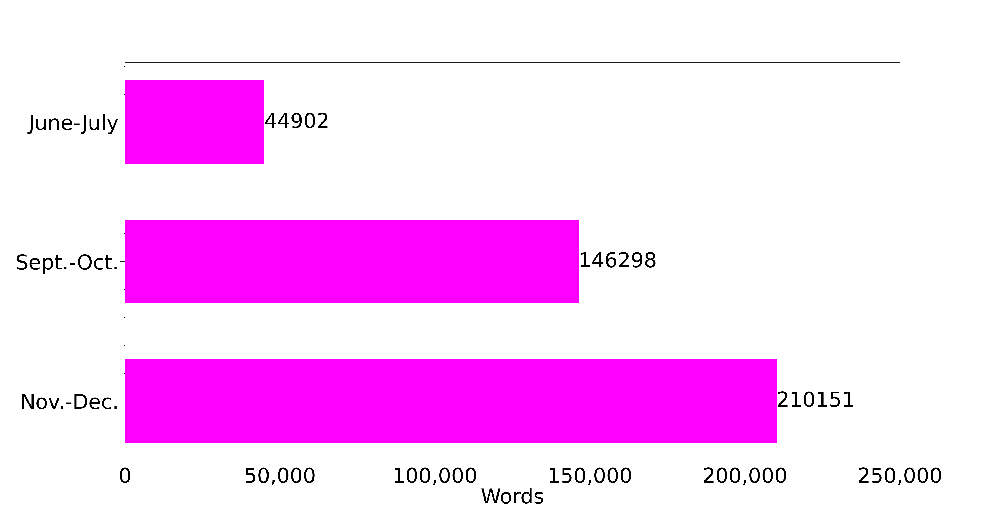

# MooersLab

## Quick Links

- [cctbx](https://github.com/MooersLab#cctbx-related)
- [Emacs](https://github.com/MooersLab#emacs-related)
- [Jupyter and Colab](https://github.com/MooersLab#jupyter-and-colab-related)
- [LaTeX](https://github.com/MooersLab#latex-related) 
- [PyMOL](https://github.com/MooersLab#pymol)
- [SAXS](https://github.com/MooersLab#small-angle-scattering)
- [supercomputing](https://github.com/MooersLab#supercomputing-related)
- [vim/neovim](https://github.com/MooersLab/MooersLab/blob/main/README.md#vim-and-neovim)
- [writing tools](https://github.com/MooersLab#writing-productivity-tools)
- [voice computing](https://github.com/MooersLab#voice-computing)
- [videos](https://github.com/MooersLab#videos-related-to-these-repos)

## Introduction
This site contains the public repositories of the Dr. Blaine Mooers Lab, Department of Biochemistry and Physiology, College of Medicine, University of Oklahoma Health Sciences Center, Oklahoma City, Oklahoma, USA.
My lab determines the structures of biomolecular molecules and their complexes with drugs, mainly using [X-ray crystallography](https://en.wikipedia.org/wiki/X-ray_crystallography#Biological_macromolecular_crystallography) and sometimes [small angle X-ray scattering](https://en.wikipedia.org/wiki/Small-angle_X-ray_scattering), a method that does not require crystals. 
We grow crystals using advanced experimental design methods and collect X-ray diffraction data in-house and frequently at the [Stanford Synchrotron Radiation LightSource](https://www-ssrl.slac.stanford.edu/content/) and sometimes at the four other significant light sources in the US.
We also do structure-based drug design using supercomputers.

We are not computer scientists; we leave the heavy-duty coding to the professionals.
However, we write code occasionally to help advance our science and the science of others.
We have developed software tools to ease the writing of PyMOL scripts to make molecular images.
These tools are available for the top 19 text editors and the Jupyter, Colab, and R Markdown notebooks. 
These text editors can make your work lighter and have many wonderful features, but Emacs is our favorite because it is the most customizable text editor, thanks to Emacs Lisp.
However, take a disciplined approach to Emacs because it is a tinker's paradise.

We often use Overleaf to write manuscripts, grant applications, slideshows, posters, and lab notebooks in LaTeX.
All the alternative Markup languages are too inflexible for our needs.
We spent five years trying the alternatives.
This was before Overleaf, which made working with LaTeX so much easier.
Some of our LaTeX templates are in repos, found here.

We are also fans of Jupyter Notebooks.
Something inexplicable about Jupyter Notebooks makes coding in them so fun.
We have developed tools for working on Jupyter with PyMOL and CCTBX.
Jupyter Notebooks may be frustrating for those without at least some formal training in computing.
You always have to be aware of the state of your computer, or at least the state in which you expected it to be.
Those who lack this awareness will run into a lot of trouble.

We code in mainly in Python but often in Bash, R, Clojure, Elisp, Julia, Fortran, and C/C++.

Repositories are grouped by category.
Some repositories are listed in several categories.
This listing is still a work in progress. 
Some repositories have not yet been added to this page.
Seventeen repos are forks to other people's repositories.
Visit the [repositories tab](https://github.com/MooersLab?tab=repositories) to see the complete list of repositories.

In the spring of 2023, I started a [MooersLab](https://codeberg.org/MooersLab) site on Codeberg.
A foundation runs Codeberg and has 13 years of funding.
Some repos on GitHub get mirrored on Codeberg.

If you like a repository, click on the star in the upper right.

<!--
(PS The ultimate text editor for writing prose and code is Emacs.
All paths through text editors lead to Emacs.
Some people get stuck all too long in Vim or NeoVim, which are great editors.)
-->

# Index of repositories

## ACA talks
- [ACA2021](https://github.com/MooersLab/ACA2021)
- [ACA2022](https://github.com/MooersLab/ACA2022)
- [ACA2023](https://github.com/MooersLab/dsd4xtals)

## Bash related
- [Bash functions for Schooner at OSCER](https://github.com/MooersLab/bashFunctions4oscer)
- [Multiple file transfer](https://github.com/MooersLab/multipleFileTransfer)

## Bayeisan Data Analysis
- [JointProb](https://github.com/MooersLab/jointprob1D) R Markdown and jupyter notebooks for the Saturday JointProb study group.

## Blog
- [Lab website with blog posts](https://mooerslab.github.io/year-archive/)

## Clojure
- [ClojConj 2023 talk about protein structure superposition via probabilistic programming in Clojure](https://www.youtube.com/watch?v=lDweOPGHLB8&t=51s)
- [quizzes about clojure](https://github.com/MooersLab/qclj) These are useful for improving command recall after a break in using Clojure for several months.

## Crystallographic computing

### CCTBX related

<a id="cctbxsnips-for-notebooks"><h4>For use in notebooks</h4></a>

- [Jupyterlab cctbx snippets](https://github.com/MooersLab/jupyterlabcctbxsnips) CCTBX snippets for JupyterLab with the *jupyterlab-snippets* extension or the jupyterlab-snippets-mutlimenus extension.
- [Jupyterlab cctbx plus snippets](https://github.com/MooersLab/jupyterlabcctbxsnipsplus) The variant of the *jupyterlabcctbxsnips* library with comments to guide editing of the snippets.
- [Tagged cctbx snippets](https://github.com/MooersLab/taggedcctbxsnips) The variant for the Elyra-snippet extension for Jupyterlab. The snippets have tags in their metadata that can be used to retrieve snippets.
- [Tagged cctbx plus snippets](https://github.com/MooersLab/taggedcctbxsnipsplus) The variant for the Elyra-snippet extension for Jupyterlab. The tab stops in a comment block guide editig of the live snippet. The snippets have tags in their metadata that can be used to retrieve snippets.
- [Colab cctbx snippets](https://github.com/MooersLab/colabcctbxsnips) Colab snippets.

<a id="cctbxsnips-for-editors"><h4>For use in text editors</h4></a>

- [cctbxsnips-Emacs](https://github.com/MooersLab/cctbxsnips-Emacs) CCTBX snippets for the *yasnippet* snippet system in for Emacs.
- [cctbxsnips-SublimeText3](https://github.com/MooersLab/cctbxsnips-SublimeText3) CCTBX snippets for Sublime Text 3 (ST3).
- [cctbxsnips-VSC](https://github.com/MooersLab/cctbxsnips-VSC) CCTBX snippets for Visual Studio Code (VSC).
- [cctbxsnips-UltiSnips](https://github.com/MooersLab/cctbxsnips-Ultisnips) CCTBX snippets for Vim or NeoVim via UltiSnips plugin.
- [cctbxsnips-neosnippets](https://github.com/MooersLab/cctbxsnips-neosnippets) CCTBX snippets for Vim or NeoVim via neosnippets plugin.
- [cctbxsnips-Snipmate](https://github.com/MooersLab/cctbxsnips-snipmate) CCTBX snippets for Vim or NeoVim via snipmate plugin.
- [cctbxsnips-Atom](https://github.com/MooersLab/cctbxsnips-Atom) CCTBX snippets for Atom.

## Curvefiting software
- [List of curve-fitting software](https://github.com/MooersLab/Curve-fitting-software) This list includes both proprietary and free software.

## Emacs related
Today's Emacs is not your grandfather's Emacs. The median age of an emacs user is 32, not 77, as you might expect for an editor about 45 years old. This is due to a very active community of young users centered around several YouTube channels, elisp being well-designed to customize Emacs, an online annual conference, the popularity of org-mode, and a very welcoming community of developers. The project is open-source and run by volunteers. According to the Lindy effect, it is pretty likely that this program will remain in use for another 45 years. Exposure to elisp coding in Emacs leads some to pick up other languages in the Lisp family, including Clojure. This, in turn, leads them to understand programming more deeply.

- [Configuration for Emacs30 to support structured editing](https://github.com/MooersLab/emacs30venturatreesitterconfig)
- [Some simple hydras in Codeberg repo](https://codeberg.org/MooersLab/emacs-hydra-examples)
- [Compiling Emacs30 on Ventura (macOS 13.2) with tree-sitter](https://github.com/MooersLab/emacs30macos13treesitter) This protocol compiles Emacs from source with tree-sitter support for structured editing of computer code on macOS.
- [Compiling Emacs30 on Ubuntu22.04 LTS with tree-sitter](https://github.com/MooersLab/emacs30ubuntu22) This protocol compiles Emacs with tree-sitter support on Ubuntu.
- [crafted-emacs user config](https://github.com/MooersLab/crafted-emacs-config) My user configuration file (config.el) for the crafted-emacs profile. I did install use-package and used it to install several packages. The base profile has the Doom theme, Vertico completion stack, and eglot. I added my org-agenda config and my favorite key bindings. I am currently *luvin* it. 
- [latex-emacs29 configuration](https://github.com/MooersLab/latex-emacs) A configuration file enhancing the use of LaTeX in Gnu Emacs version 29.0.5. Includes org-mode configuration.
- [latex-emacs28 configuration](https://github.com/MooersLab/latexemacs28) Similar to above but for Gnu Emacs version 28.
- [latex-emacs30 configuration](https://github.com/MooersLab/latexemacs30) Similar to above but for Gnu Emacs version 30.
- [scimax user.el](https://github.com/MooersLab/scimaxuserconfig) Scimax is the Emacs configuration that John Kitchin is developing to support reproducible research by scientists with Gnu Emacs. The *user.el* file for scimax enables scimax users to add keybindings and packages. I added features from latex-emacs and config.org.
- [config.org](https://github.com/MooersLab/configorg) My default configuration file for GNU Emacs version 30.
- [Writing log template in Org-mode](https://github.com/MooersLab/writingLogTemplateInOrg) Template for tracking your actions, decisions, and plans for any serious writing project that takes more than one session to finish. The LaTeX version is listed in the LaTeX section for use on Overleaf or in Emacs.
- [Org-mode manuscript template](https://github.com/MooersLab/manuscriptInOrg) The manuscript will be exported to PDF after being run through LaTeX. This is for the first submission. This is for the lovers of org-mode. The export from org to PDF is fast and painless in Emacs.
- [Slides about workflow in LaTeX](https://github.com/MooersLab/BerlinEmacsAugust2022) presented to the Berlin Emacs Meetup August 2022. Not recorded. It was a 90-minute presentation.
- [snippets for latex-mode in Emacs](https://github.com/MooersLab/snippet-latex-mode) My LaTeX code snippets for yasnippets.
- [Quizzes about Emacs to improve recall of keybindings](https://github.com/MooersLab/qemacs) Ten minutes boosting your recall on a particular topic can save 10, 100, or 1000 hours of Google searches, espcially if you are prone to getting side-tracked in the Google-verse.
- [Slides from talk about GhostText, Data Science Workshop, July 2022](https://github.com/MooersLab/DSW22ghosttext) GhostTexT rocks! It enables the editing of textboxes on web sites with Emacs. You can use GhostText to bring the full power of Emacs to Overleaf (*Important:*  use the legacy version rendering of the text area in Overleaf to get text impoted into a LaTeX buffer).
- [Video link to talk about GhostText, Oklahoma Data Science Workshop, July 2022](https://mediasite.ouhsc.edu/Mediasite/Channel/python/watch/4da0872f028c4255ae12935655e911321d)
- [emacsconf 2021 talk about rendering molecular graphics with PyMOL in org literate programming files](https://emacsconf.org/2021/talks/molecular/) Video and comments.
- [emacsconf 2022 talk about using Emacs to edit Jupyter cells via GhostText and atomic-chrome](https://emacsconf.org/2022/talks/jupyter/) Video and comments.
- [EmacsATX Meetup Talk, 4 May 2022: functional programming in Emacs lisp](https://github.com/MooersLab/EmacsATX4May2022) Slides. 

## Jupyter and Colab related

### Jupyter and PyMOL

PyMOL can be run in Jupyter via PyMOL's Python API.

#### Snippet libraries for direct use in Jupyter

Multiple extensions for Jupyter support the use of snippets.
However, the support does not include tab stops nor tab triggers, two standard features of snippet support in modern text editors.
The libraries with `plus` at the end of their name have a second copy of the code in a comment.
This copy is marked with the sites of the tab stops where you might want to change the parameter value from its default value.

##### Classics Notebook
PyMOL Python snippets for use in the Classic Jupyter Notebook with the `snippets_menu` notebook extension.

- [jupyternbclassicpymolpysnips](https://github.com/MooersLab/jupyternbclassicpymolpysnips) 
- [jupyternbclassicpymolpysnipsplus](https://github.com/MooersLab/jupyterlabpymolpysnipsplus) 

##### JupyterLab

PyMOL Python snippets for use in JupyterLab with the jupyterlab-snippets extension.

- [jupyterlabpymolpysnips](https://github.com/MooersLab/jupyterlabpymolpysnips) PyMOL Python snippets for use in JupyterLab with the jupyterlab-snippets extension.
- [jupyternbclassicpymolpysnipsplus](https://github.com/MooersLab/jupyternbclassicpymolpysnipsplus)

PyMOL Python snippets for use with the elyra-snippets extension and with PyMOL.
These snippets can be retrieved with tags in the elyra-snippet GUI.

- [taggedpymolpysnips](https://github.com/MooersLab/taggedpymolpysnips) 
- [taggedpymolpysnipspymolpysnipsplus](https://github.com/MooersLab/taggedpymolpysnipspymolpysnipsplus)
  
#### Snippet libraries for using external editors of Jupyter notebooks 
These editors work in Jupyter Notebooks via the GhostText browser plugin.

- [jupyter-vsc-pymolpysnips](https://github.com/MooersLab/jupyter-vsc-pymolpysnips)
- [jupyter-st3-pymolpysnips](https://github.com/MooersLab/jupyter-st3-pymolpysnips)
- [jupyter-emacs-pymolpysnips](https://github.com/MooersLab/jupyter-emacs-pymolpysnips)
- [jupyter-ultisnips-pymolpysnips](https://github.com/MooersLab/jupyter-ultisnips-pymolpysnips)
- [jupyter-snipmate-pymolpysnips](https://github.com/MooersLab/jupyter-snipmate-pymolpysnips)
- [jupyter-neosnippets-pymolpysnips](https://github.com/MooersLab/jupyter-neosnippets-pymolpysnips)
- [jupyter-atom-pymolpysnips](https://github.com/MooersLab/jupyter-atom-pymolpysnips)
  
##### Demo of GhostText with Jupyter and Emacs

- [emacsconf 2022 talk about using Emacs to edit Jupyter cells via GhostText and atomic-chrome](https://emacsconf.org/2022/talks/jupyter/)

### Colab and PyMOL
- [colabOpenSourcePyMOLpySnips](https://github.com/MooersLab/colabOpenSourcePyMOLpySnips) PyMOL Python snippets for use in Colab with open source PyMOL.
- [colabPyMOLpySnips](https://github.com/MooersLab/colabPyMOLpySnips) PyMOL Python snippets for use in Colab with the incentive PyMOL.

### CCTBX specific
- [Jupyterlab cctbx snippets](https://github.com/MooersLab/jupyterlabcctbxsnips) CCTBX snippets for JupyterLab with the jupyterlab-snippets extension or the jupyterlab-snippets-mutlimenus extension.
- [Jupyterlab cctbx plus snippets](https://github.com/MooersLab/jupyterlabcctbxsnipsplus) The variant of the jupyterlabcctbxsnips library with comments to guide editing of the snippets.
- [Colab cctbx snippets](https://github.com/MooersLab/colabcctbxsnips) Colab snippets.

## LaTeX related
Until recently, I wrote a lot in Emacs on 750words.com via GhostText. 
I configured the atomic-chrome package for Emacs to go into LaTeX mode when GhostText connects to 750words. 
I can also use Emacs to write and edit text in Overleaf via atomic-chrome and GhostText. 
This is a very cool way to extend Emacs to websites that have weaker support for editing text.

Now I use voice-to-text to dictate in 750words.com or Overleaf.
I use voice commands to insert snippets containing LaTeX code.
See the [voice computing](https://github.com/MooersLab/MooersLab/blob/main/README.md#voice-computing-for-enchanced-productivity) section below.

- [LaTeX bare bones template file](https://github.com/MooersLab/barebonesLaTeX/tree/main) This template is for those people want make a simple document without a lot of bells-and-whitsles.
- [LaTeX tips](https://github.com/MooersLab/latextips)
- [Configuration for Emacs30 to support structured editing](https://github.com/MooersLab/emacs30venturatreesitterconfig)
- [latex-emacs29 configuration](https://github.com/MooersLab/latex-emacs) A configuration file enhancing the use of LaTeX in Gnu Emacs version 29.0.5. This is the current release version of Gnu Emacs. Includes org-mode configuration.
- [latex-emacs28 configuration](https://github.com/MooersLab/latexemacs28) Similar to above but for Gnu Emacs version 28.
- [latex-emacs30 configuration](https://github.com/MooersLab/latexemacs30) Similar to above but for Gnu Emacs version 30.
- [Slides about workflow in LaTeX](https://github.com/MooersLab/BerlinEmacsAugust2022) presented to the Berlin Emacs Meetup August 2022. Not recorded. It was 90-minute lecture.
- [slideshowTemplateInLaTeX](https://github.com/MooersLab/slideshowTemplateLaTeX) Slideshow template in Beamer makes slides that do not look like they were made in LaTeX.
- [posterInLaTeX](https://github.com/MooersLab/posterInLaTeX) Uses beamer to make a poster via a simple design. Enables whipping together a poster a few hours. It is much easier than using powerpoint.
- [LaTeX manuscript template](https://github.com/MooersLab/manuscriptInLaTeX) Generic template for the first submission as a PDF.
- [Writing log template in LaTeX](https://github.com/MooersLab/writingLogTemplate) Place to track progress and plans behind a manuscript.
- [Annotated bibliography template in LaTeX](https://github.com/MooersLab/annotatedBibliography) Every writing project needs one of these.
- [Diary for 2024 in LaTeX](https://github.com/MooersLab/diary2024inLaTeX) Designed for use on Overleaf.com but can compile locally. Each day is a section. Each month is a chapter. Has an automatically generated index (most markdowns cannot generate indices). Very feature-rich and ready to use. Makes a great electronic scientific notebook because it is searchable and indexed. >1000 page document at end of years compiles to PDF in under a minute on overleaf. 
- [snippets for latex-mode in Emacs](https://github.com/MooersLab/snippet-latex-mode) My LaTeX code snippets for yasnippets.
- [The writer's creed](https://github.com/MooersLab/thewriterslaw) Guidelines for greater productivity as a writer.
- [bib2item3](https://github.com/MooersLab/bib2item3) Python script to convert bibtex.bib file to bibitems in tex file format. Bibitems are required by some publishers. They are a pain to create manually.
- [LaTeX Voice In Plus library](https://github.com/MooersLab/latex-voice-in) Speech-to-text commands for inserting LaTeX markup.

## Molecular Graphics related
[Collection of links for a 15-hour course on Molecular Graphics](https://mooerslab.github.io/MolecularGraphicsLinks/index.html)

#### PyMOL
- [pymolrc](https://github.com/MooersLab/pymolrc) My pymolrc file.
- [pymolsnips](https://github.com/MooersLab/pymolsnips) A large collection of PyMOL macro language (pml) code snippets. Contains link to a webpage with extensive instructions on installing 19 text editors.
- [pymolshortcuts](https://github.com/MooersLab/pymolshortcuts) A large collection of functions mapped to aliases or shortcuts. This colleciton of functions is very useful for non-coders.
- [EasyPyMOL](https://github.com/MooersLab/EasyPyMOL) Support for horizontal scripting in PyMOL.
- [orgpymolpysnips](https://github.com/MooersLab/orgpymolpysnips) Support for generating computational narratives (literate programming plus interactive computing) in org-mode with PyMOL.
- [rstudiopymolpysnips](https://github.com/MooersLab/rstudiopymolpysnips) Support for literate programming in Rstuido with PyMOL.
- [taggedpymolpysnips](https://github.com/MooersLab/taggedpymolpysnips) Support for literate programming in JuptyerLab with tagged snippets with the elyra-snippets extension and with PyMOL.
- [jupyterlabpymolpysnips](https://github.com/MooersLab/jupyterlabpymolpysnips) PyMOL Python snippets for use in JupyterLab with the jupyterlab-snippets extension.
- [jupyternbclassicpymolpysnips]() PyMOL Python snippets for use in the Classic Jupyter Notebook (invoked with `jupyter nbclassic` with Jupyter Notebook version 7).
- [colabOpenSourcePyMOLpySnips](https://github.com/MooersLab/colabOpenSourcePyMOLpySnips) PyMOL Python snippets for use in Colab with open source PyMOL.
- [colabPyMOLpySnips](https://github.com/MooersLab/colabPyMOLpySnips) PyMOL Python snippets for use in Colab with the incentive version of PyMOL.
- [PyMOL wall hangings](https://github.com/MooersLab/PyMOLwallhangings) Protocol for making oversized images to be framed and hung on a wall.
<!--
## Structure-based Drug Design
-->

## R statistical program
- [rstudiopymolpysnips](https://github.com/MooersLab/rstudiopymolpysnips) Support for literate programming in Rstuido with python code for PyMOL.

## Small Angle Scattering
- [SmallAngleScatteringWebpage](https://mooerslab.github.io/SmallAngleScatteringWebpage/index.html)

## Time management
- [TimeSpent](https://github.com/MooersLab/timeSpent) Time tracking by project with Google Sheets.

## Supercomputing related 
Includes high performance computing (HPC), cluster computing, and cloud computing.

- [Bash functions for Schooner at OSCER](https://github.com/MooersLab/bashFunctions4oscer)
- [Emacs configuration file for schooner supercomputer](https://github.com/MooersLab/emacs4oscer)
- [Multiple file transfer with sshpass and scp](https://github.com/MooersLab/multipleFileTransfer)
- [Vim configuration file for the schooner supercomputer at OU-Norman](https://github.com/MooersLab/vimrc4oscer) 
- [Vim configuration file for SSRL SMB cluster](https://github.com/MooersLab/vimrc4ssrl)
- [Tutorial for biologists on using the supercomputer at OU-Norman](https://github.com/MooersLab/oscer-supercomputer-tutorial)

## Vim (and Neovim)
- [Vim configuration file](https://github.com/MooersLab/vimrc) Current vimrc file for Mac OSX 10.15
- [Vim configuration file for schooner supercomputer](https://github.com/MooersLab/vimrc4oscer) 
- [Vim configuration file for SSRL SMB cluster](https://github.com/MooersLab/vimrc4ssrl)
- [Neovim configuration file](https://github.com/MooersLab/neovim-init-file)
- [qvim](https://github.com/MooersLab/qvim) Quiz about Vim commands to improve your recall of the commands after a break from using Vim.

## Voice computing
The voice computing can be divided into three activities: speech-to-text (dictation), speech-to-commands, and speech-to-code.
The first is the easiest to master.

Voice Typing is widely available through Google Docs.
It is more accurate than the Voice Control that comes with the Mac and MS Word.
Voice Typing supports almost 100 voice commands, but it does not support custom commands.

Voice In Plus has similar accuracy to Voice Typing with the addition of custom commands. 
I use the latter every day for dictation for first drafts.
I do the rewriting using the keyboard.

OpenAI's whisper may be an order of magnitude more accurate.
It has a latency issue so live transcription and interactive editing are not easy.
It is also not easy to fine tune with custom commands.
My main use for is for transcribing audio files.

The superwhisper.app for the Mac is interesting.
It supports dication in e-mail and elsewhere.
Its support for custom commands is very limited; it does not yet support including bulk uploading of text replacements.

Talon Voice supports all three activities, but speech-to-text accuracy lags behind Voice Typing and Voice In Plus in my experience.
I am currently using Talon Voice for the last two activities.
I hope to increase my use of Talon Voice for dictation gradually.
Talon Voice has a bit of a learning curve because it is highly customizable by the user, but the software is designed to be used by noncoders.
For example, you can do a lot of customization using the Talonscript files and without writing any Python code.
Talonscript has a syntax that is a tiny subset of Python's syntax.

Voice computing supports extending your productivity when you get tired of typing.
Voice computing also supports issuing commands and dictating text while standing.
Voice computing could be a cure for the envy of standing desks.
You can speak commands to your computer while standing 20 feet away from it and looking out the window.
You can give your body a break from sitting and your eyes a break from staring at the computer screen while remaining productive.

I have seen a three-fold increase in the total number of words captured in September and October 2023 compared to June and July 2023 before I took up speech-to-voice in mid-August 2023.
I have had the same amount of out-of-town business travel during the first two periods.
I had not made a conscious effort to capture more words per day.

On the day after Thanksgiving, I generated almost 12,000 words.
I made a concerted effort to generate at least 5,000 words a day from that point to just before Christmas.
Then family obligations that reduced my daily word generation.
Nonetheless, I had a five-fold increase in the total word count for November and December.
I think a that six-seven fold increase may be possible.
Overall, it seems that a 5-fold increase in word count may be more sustainable if you make a conscious effort.
I expect that a three-fold increase is more realistic with all of the disruptions from doing experiments, administration, teaching, service and travel.

It is too early to tell how the increased word counts will translate into increased published products.
I do not expect a 300% increase in publications, but even a 30% increase would be a good return investment.

Below are links to programming tools to aid the adoption of voice computing.

### Talon Voice related
- [Expand dictated contractions automatically](https://github.com/MooersLab/talon-contractions)
- [Open favorite web pages by voice commands](https://github.com/MooersLab/talon-webpages)
- [Master Talon Voice phonetic alphabet with interactive quiz written in Python](https://github.com/MooersLab/talon-voice-quizzes)
- [Master Talon Voice with interactive quiz written in elisp for Emacs](https://github.com/MooersLab/talon-voice-quiz.el)

### Voice In Plus related
- [Master basic Voice In commands with interactive Python quiz](https://github.com/MooersLab/voice-in-basics-quiz)
- [Master basic Voice In commands with interactive quiz in Emacs](https://github.com/MooersLab/voice-in-basics-quiz.el)
- [Library of 94 English contractions](https://github.com/MooersLab/voice-in-plus-contractions)
- [Full library of commands for Voice In Plus](https://github.com/MooersLab/voice-in-plus-commands)
- [Org-mode](https://github.com/MooersLab/org-mode-voice-in/tree/main)
- [Biological crystallography](https://github.com/MooersLab/biological-crystallography-voice-in)
- [Artificial intelligence](https://github.com/MooersLab/artificial-intelligence-voice-in)
- [Bayesian Data Analysis](https://github.com/MooersLab/bayesian-data-analysis-voice-in/blob/main/README.md)
- [NIH grants](https://github.com/MooersLab/nih-grants-voice-in)
- [LaTeX](https://github.com/MooersLab/latex-voice-in)
- [Generate new writing project commands](https://github.com/MooersLab/new-writing-project-voice-in)

### Voice Typing in Google Docs related
- [Master Voice Typing commands with interactive quiz](https://github.com/MooersLab/voice-typing-quiz)

### Whisper related
- [Bash function to transcribe audio files with whisper](https://github.com/MooersLab/bash-whisper-transcription) 

### Related talks
I have given two talks on this topic: one at the regional level and one at the international level.

- [Data Science Workshop talk on speech-to-text, 2023 Nov. 16](https://mediasite.ouhsc.edu/Mediasite/Channel/python/watch/21e8b9a65d044d01a264df1f19db261b1d)
- [emacsconf23 talk speech-to-text and speech-to-commands, 2023 Dec. 2 on YouTube](https://www.youtube.com/watch?v=Z7l1ImjXOWM)
- [ditto but on the emacsonf.org website](https://emacsconf.org/2023/talks/voice/)

## Writing productivity tools
These are some programming tools designed to support greater writing productivity. There are three elements: progress tracking, support for manuscript writing in LaTeX, and the writing log. The last might be the most tool for organizing and managing a writing project. It is analogous to a project specific laboratory notebook.

### Progress tracking
For writing tasks that cannot be completed in one seating, progress tracking can support momentum and enthusiasm for the project.

- [Track writing progress in 2024 and 2025](https://github.com/MooersLab/writing-progress-2024-25)
- [The writer's creed](https://github.com/MooersLab/thewriterslaw) Guidelines for greater productivity.
- [Writing contract template](https://github.com/MooersLab/writingContract) This contract is in Microsoft Word, markdown, LaTeX, and org-mode. This accountability system works only if your partner has a similar level of commitment to daily writing. I had a good run of four years with one person from out-of-state. I would consider doing this again.
- [TimeSpent](https://github.com/MooersLab/timeSpent) Hourly time tracking by project with Google Sheets. This is useful for making monthly time reports and learning how much various writing projects actually take.

### Manuscript writing support
- [LaTeX manuscript template](https://github.com/MooersLab/manuscriptInLaTeX) Generic template for the first submission as a PDF.
- [Annotated bibliography Template in LaTeX](https://github.com/MooersLab/annotatedBibliography) Every writing project needs one of these.
- [bib2item3](https://github.com/MooersLab/bib2item3) Python script to convert bibtex.bib file to bibitems in tex file format. Bibitems are required by some publishers. They are a pain to create manually.
- [Emacsconf 2022 talk about GhostText on YouTube, December 2022](https://www.youtube.com/watch?v=2NPUDYAOgW0&t=3s) Includes demonstration of using Emacs to edit a document in Overleaf.

- [LaTeX Voice In Plus library of speech-to-text commands](https://github.com/MooersLab/latex-voice-in)

### Writing log for planning manuscripts
- [Writing Log template in LaTeX](https://github.com/MooersLab/writingLogTemplate). The favored format. LaTeX beginers can use this document easily on Overleaf without any configuration.
- [Writing log template in Org-mode](https://github.com/MooersLab/writingLogTemplateInOrg) Has all of the features of the LaTeX variant. Favored by many Emacs users. Org-mode is a powerful analog of markdown that can interpret LaTeX code blocks. It is vastly more capable than markdown. It even supports literate programming.
- [Writing log template in reStructuredText](https://github.com/MooersLab/writing-log-rst) reStructuredText is used by programmers for documentation.
- [Writing log template in Markdown](https://github.com/MooersLab/writing-log-md) Markdown variant. Read and rendered to PDF by most good text editors.
- [Writing log template in ODT](https://github.com/MooersLab/writing-log-odt) ODT can be read by Open Office, LibreOffice and MS Word.
- [Writing log template in DOCX for MS Word](https://github.com/MooersLab/writing-log-docx) MS Word variant. Probably the least suitable format for this task.

## Videos related to these repos
- [Snippets in Jupyter Notebooks](https://www.youtube.com/watch?v=LjJvhfJvla4), OKC Python Meetup, 10 May 2019.
- [Why develop a snippet library for Jupyter in your subject domain?](https://www.youtube.com/watch?v=sZNCAwW5dYg&amp;t=11s)  JupyterConn 2020.
- [Reproducible molecular graphics with Org-mode](https://www.youtube.com/watch?v=ZTocGPS-Uqk&amp;t=2s), EmacsConf 2021.
- [Edit live Jupyter notebook cells with Emacs](https://www.youtube.com/watch?v=2NPUDYAOgW0), EmacsConf 2022.
- [Enhancing productivity with voice computing](https://emacsconf.org/2023/talks/voice/), EmacsConf 2023.
- [Managing multiple writing projects]([https://emacsconf.org/2023/talks/voice/](https://mediasite.ouhsc.edu/Mediasite/Channel/python/browse/null/most-recent/null/0/null)), Data Science Workshop Jan, 2024.
  
**MooersLab/MooersLab** is a ✨ _special_ ✨ repository because its `README.md` (this file) appears on his GitHub profile 👋.

<!--

Here are some ideas to get you started:

- 🔭 I’m currently working on ...
- 🌱 I’m currently learning ...
- 👯 I’m looking to collaborate on ...
- 🤔 I’m looking for help with ...
- 💬 Ask me about ...
- 📫 How to reach me: ...
- 😄 Pronouns: ...
- ⚡ Fun fact: ...
- 👋
-->
